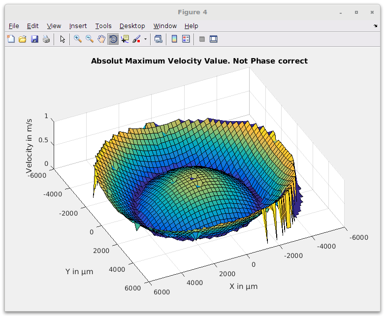
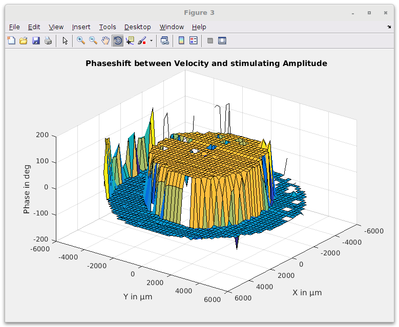
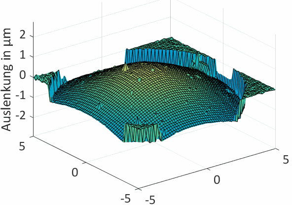
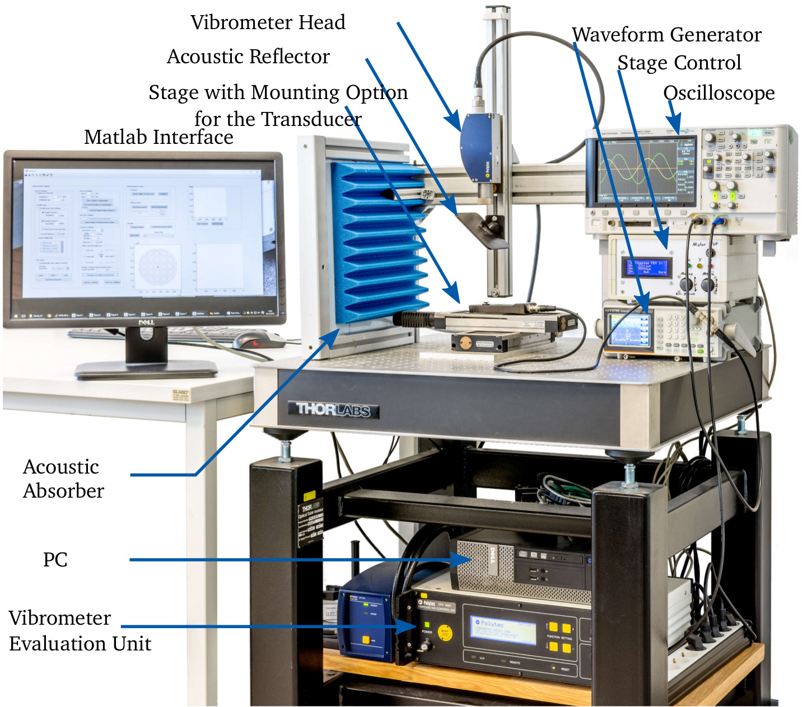
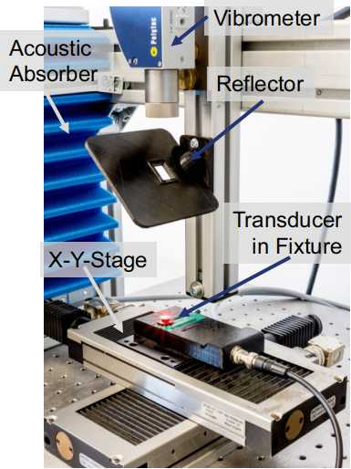
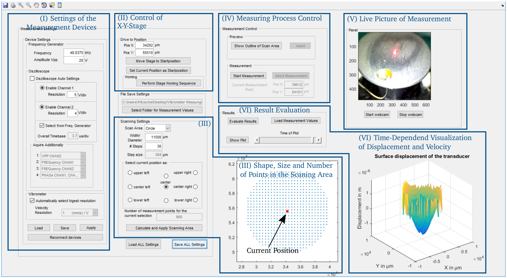

# Vibrometer Surface-Scan
Matlab based measurement setup for a vibrometer surface-scan to obtain the
**velocity** and **change of displacement**.

This sofware was a by-product of my master-thesis at the TU-Darmstadt. I
had to characterize the mechanical properties of several ultrasonic transducers to verify the simulations I was running in COMSOL-Multiphysics. To increase the accuracy of my reference data I decided to obtain the velocity and displacement at the whole surface area of the transducer. To do so, I used one of the two laser-vibrometers (Polytec OFV-534) we had at our institute. These can measure the velocity in just one point. So to get the whole area covered, I decided to use a small x-y-stage which would move the transducer below the laser-vibrometer and control the complete setup in matlab. 

It features the measurement of:
+ velocity
+ displacment
And saves these parameters:
+ time-dependent over 1.5 period
+ in addition to the excitation voltage
+ additionally the phase-shift between excitation and mechanical parameter

The area of interest can be shaped as a:
+ square
+ cirle
+ straigt line
	- horizontal
	- vertical
	- diagonal (/ or \)
+ single point

Additionally
+ all the settings and the whole routine is controled by matlab (so you can
  use via remote-desktop)
+ a usb-microscope shows the live progress in the matlab interface

## Setup
Setup is fairly easy. Just clone/download the git and run it in matlab.
To clone either use ``` git clone https://github.com/T-Fritzsche/Vibrometer ``` or download the zip-file above.
Then ``` open matlab ```, navigate to the folder and ``` run Interface.m```.
Follow the instructions in the interface to run the measurement.

### Problems at startup
In case the application dies with an error message containing *'Connection to devices failed - check and try to reconnect'* make sure the ennumeration of the COM-ports in /functions/connectDevices.m matches the setup. Windows tends to changes the numbers every now and then.

## Results
Once the measurement was successful a click on ```Evaluate Measurements``` generates three plots of velocity and displacement in **PHASE** and **AMPLITUDE**. Additionally a time-dependent representation is shown in the interface and can be controlled by a slider. All plots and a .mat file with the time-dependent information will be saved in the specified directory.
Plot of the amplitude | Plot of the Phase | Time-dependent
:----------------------------:|:-------------------------:|:--------:
||


## System
 


 


## Usage


###Resultfile


# Todo
As the time has run out and I had to move on the the other tasks of my thesis, some things aren't fully implemented:
+ The evaluation routine can't distinguish between area (square/circle), line or point plots. So if you did a line plot you'll end up with a 1xn cell which you have the check yourself. There is the function ``` manualEvaluation/evaluateMeasurementLinePlot.m``` which can do it step wise. To integrate it in the full interface some differentiation needs to be added.
+ The **Auto** function considers the range of the vibrometer only. It would be nice to adapt the scale of the oscilloscope at every measurement point. This would result in the largest repesentable wave-sine and therefore increase the overal resolution.


